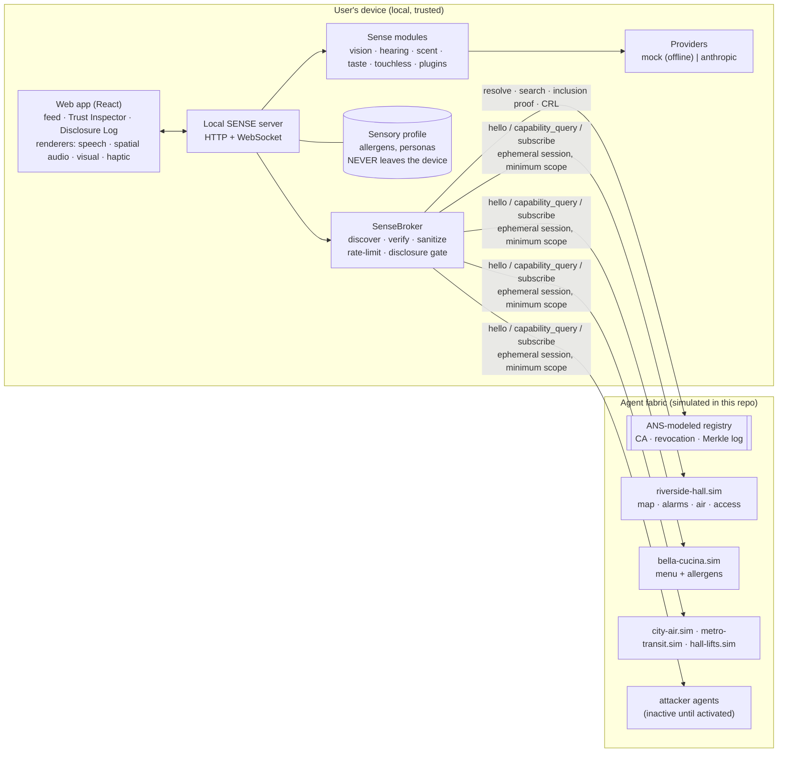
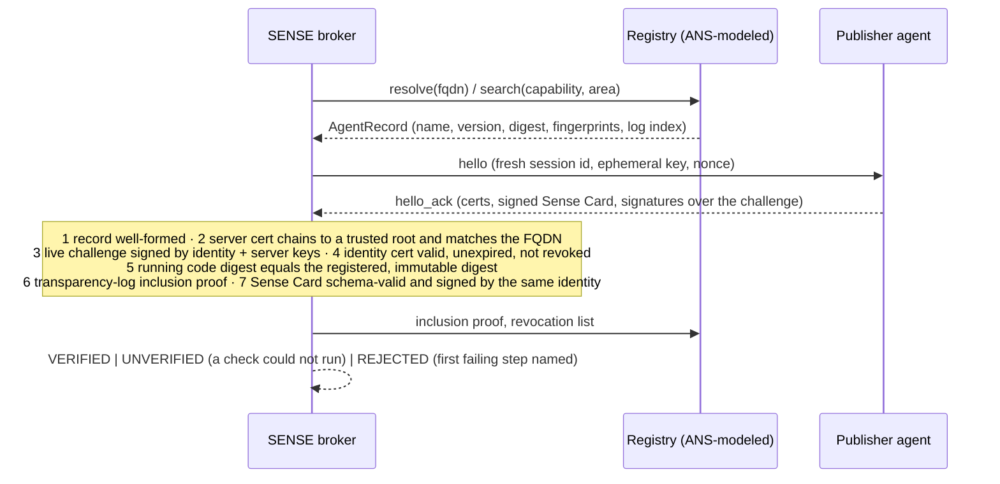

# Architecture

> Everything described here runs today, in a simulated world. Nothing in this repository talks to a
> real building, restaurant, sensor network or ANS registry.

SENSE is a **personal broker agent** on the user's own device. It does not perceive the world itself.
It finds the parts of the world that already perceive themselves, checks who they really are, treats
what they say as data, and translates it into the senses the user prefers, with the source and the
level of trust visible on everything.

## Components

| Package                 | Role                                                                                                   |
| ----------------------- | ------------------------------------------------------------------------------------------------------ |
| `packages/protocol`     | Zod schemas (Percept, Provenance, Profile, Sense Card, agent messages), personas, sanitizer, safety guard, geometry, clocks. Browser-safe. |
| `packages/identity`     | ANS-**modeled** identity: local CA (two roots), X.509, revocation, Merkle transparency log, 7-step verification, `PublisherIdentity`. Node only. |
| `packages/core`         | `SenseBroker`, trust engine (freshness, tiers, conflicts), rate limiter, disclosure gate, frozen policy, signed portable profile. |
| `packages/providers`    | LLM abstraction (`structured()` = validate, retry once, degrade), Anthropic client, offline mock fixtures, audio classifier interface. |
| `packages/render`       | `route(percept, profile)` → modalities; earcons, haptic patterns; Web Speech / Web Audio / Vibration renderers with honest fallbacks. |
| `packages/senses/*`     | `vision`, `hearing`, `scent`, `taste`, `touchless`, and the `crowd` plugin.                            |
| `apps/world-sim`        | Simulated publishers, attackers, deterministic timeline, HTTP view with per-hostname virtual hosting.  |
| `apps/server`           | Local API, WebSocket push, the golden demo scenes, demo mode.                                          |
| `apps/web`              | The accessible React app.                                                                              |

## The trust model

Every percept carries provenance: a tier, a source and evidence.

| Tier         | Meaning                                                                                              | Who produces it                 |
| ------------ | ---------------------------------------------------------------------------------------------------- | ------------------------------- |
| `VERIFIED`   | The remote agent passed all 7 identity checks **and** its data is fresh.                             | Publisher agents                |
| `INFERRED`   | SENSE's own camera, microphone or model guessed it. Always shows a confidence.                       | SENSE's senses                  |
| `UNVERIFIED` | Agent reachable but a check could not run, or its data is older than the freshness it declared.      | Publisher agents (downgraded)   |
| `REJECTED`   | Identity or content checks failed. **Never routed as information.** Appears only as a security event. | Nobody, by construction         |

Rules the code enforces (and the invariants suite tests):

- SENSE never asserts safety it cannot verify. "No hazard reported by verified sources" is allowed; "the air is safe" is not. A guard on every percept rejects assurance wording.
- Stale data is never `VERIFIED`. A safety feed that goes quiet is reported as unknown, never assumed unchanged.
- When sources disagree, both are shown, ordered by tier; nothing is silently dropped.
- Life-safety urgency 4 requires a `VERIFIED` source. Inferred sounds cap at urgency 3.

### The 7-step verification pipeline

The first failure rejects the agent and later steps are shown as skipped. A step that cannot run (log
or revocation list unreachable) yields `UNVERIFIED`, and the remaining steps still run.

### Remote content is data

```mermaid
flowchart LR
  raw["raw message (untrusted)"] --> parse["strict schema parse\n(unknown keys rejected, lengths capped)"]
  parse --> sig["signature check\n(verified identity key)"]
  sig --> san["sanitizer\ndrops whole field if instruction-like\nor reassuring"]
  san --> fresh["freshness from the payload's own timestamps"]
  fresh --> tier["tier assignment"]
  tier --> map["SENSE builds the wording itself\n(remote text only quoted as a 'publisher note')"]
  map --> guard["safety guard: no assurance wording,\nREJECTED never routed"]
  guard --> feed["percept feed"]
```

Remote text can never change SENSE's policy (deep-frozen), profile, or tool permissions. Unsolicited
pushes are never routed at all.

## From percept to a person

`route(percept, profile)` picks modalities from the profile's per-urgency row (with per-sense overrides),
quiets non-safety percepts from senses the user does not need translated, and guarantees at least two
modalities for safety percepts at urgency 3 or higher. It always produces a caption for audio output
and an ARIA politeness (assertive from urgency 3). Renderers degrade honestly: no voice means captions,
no vibration means a visual pattern and its text description.

## Privacy by design

- The profile (including declared allergens) lives in the local process. The outbound gate validates
  every request against a strict schema and refuses anything containing profile values.
- Each connection uses a fresh random session id and ephemeral key; nothing identifies the user.
- Every message sent is recorded in the Disclosure Log, exactly as sent.
- Audio and camera frames are processed in memory; only derived events or descriptions are used.
- No analytics or telemetry. The only optional network call is a connectivity ping at startup.

## Extension points

| To add…                | Do this                                                                                          | Core changes |
| ---------------------- | ------------------------------------------------------------------------------------------------ | ------------ |
| A new **sense**        | Implement `SenseModule { id, inputs, produce(): AsyncIterable<Percept> }`. `packages/senses/crowd` is one in 64 lines. | none         |
| A new **input device** | Implement `InputDevice` (start/stop/pause, emit intents). The controller and app need no change. | none         |
| A **publisher**        | `npm run create-sense-agent`, see [PUBLISH_AN_AGENT.md](PUBLISH_AN_AGENT.md).                     | none         |
| A **model provider**   | Implement `LlmClient.complete()`; `structured()` adds validation, retry and honest degradation.  | none         |
| An **audio classifier**| Implement `AudioClassifier.classify()`; the Echo percept builder is unchanged.                    | none         |
| A **capability**       | Add a schema in `payloads.ts`, an id in `sensecard.ts`, a scope in the policy.                    | small        |

Discovery is by **capability and area**, not by hard-coded names, and the broker holds no global state
about publishers: it works with whichever verified agents are in range.

## Simulated versus real

| Real (works today)                                                                 | Simulated or stubbed                                                          |
| ---------------------------------------------------------------------------------- | ----------------------------------------------------------------------------- |
| X.509 certificates, ECDSA signatures, Merkle inclusion proofs, revocation lists    | The registry, CA and DNS: a local `.sim` world. No ACME, no public CA, no DNSSEC. |
| Schema validation, sanitization, rate limiting, disclosure gate                    | Publishers, sensors, attackers, the user's position, the soundscape          |
| DSP for sound classification (FFT, tonality, transients, stereo level difference)  | The AI "vision" and "taste" reasoning: mock fixtures offline                 |
| Routing, renderers, accessibility, input-device logic                              | The Anthropic client is implemented but was **not exercised against the live API** |
| Persistence of dev keys in a gitignored directory                                  | `LiveAnsClient`: a typed stub that throws `NotConfigured`                    |
